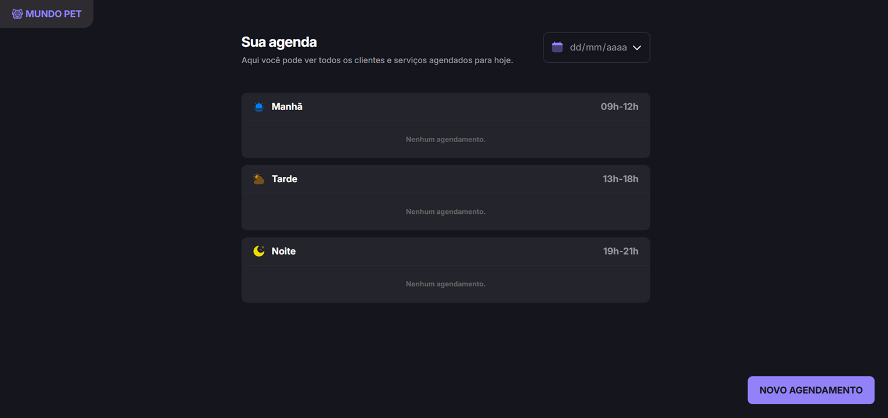

# Petshop Appointment ✨

Projeto desenvolvido durante os estudos de **JavaScript**, com foco na manipulação do DOM, eventos, formulários e lógica de programação para um sistema de agendamento de atendimentos em um pet shop.

## 📌 Descrição

O **Petshop Appointment** é uma aplicação desenvolvida em JavaScript puro que permite cadastrar e organizar agendamentos de atendimentos para pets.

Os atendimentos são separados automaticamente por período do dia (manhã, tarde e noite), com validações para impedir horários inválidos e conflitos de agendamento, proporcionando uma experiência simples e intuitiva.

## 🚀 Tecnologias

  
  
  

## 💻 Projeto

Entre as principais funcionalidades do projeto estão:

- Cadastro de novos agendamentos.
- Validação dos campos obrigatórios.
- Validação do horário de funcionamento.
- Organização automática dos atendimentos por período do dia.
- Bloqueio de agendamentos duplicados para a mesma data e horário.
- Remoção de agendamentos.
- Manipulação dinâmica do DOM utilizando JavaScript puro.

## 🔖 Layout

O layout foi desenvolvido como parte do desafio prático da formação, com foco na prática dos fundamentos do JavaScript e na manipulação dinâmica da interface.

---

<small>Thank you for reading! ❤️</small>
